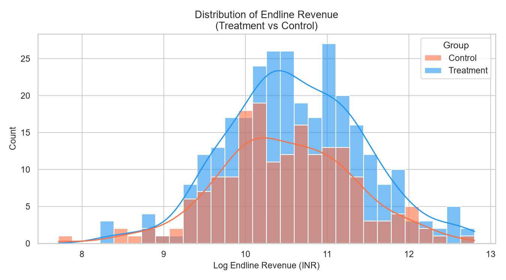
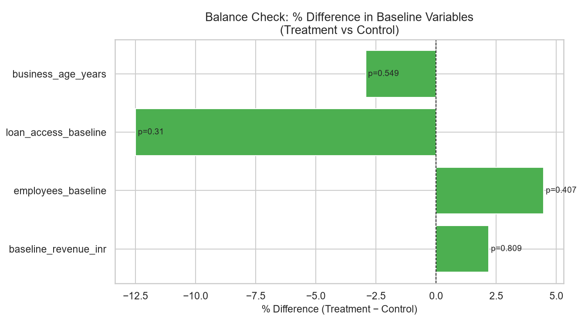
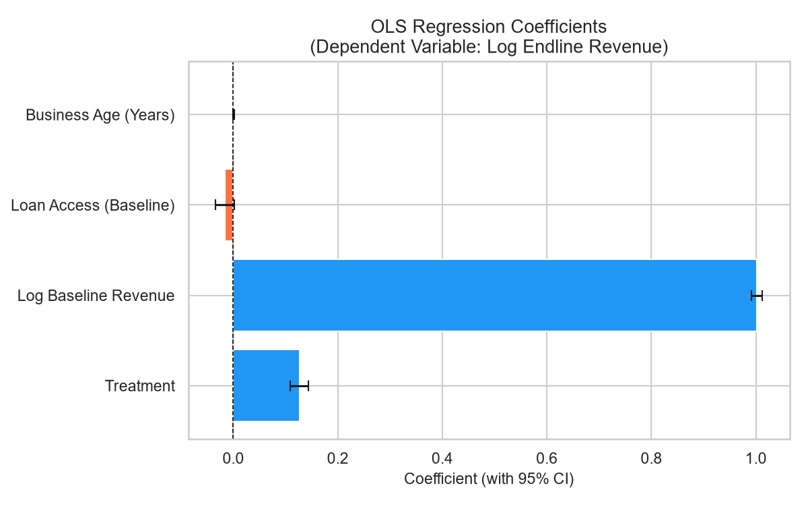

# Women-Led MSME Impact Evaluation Pipeline

## Overview
This is a reproducible pipeline simulating an impact evaluation of financial access interventions on Women-led Micro, Small & Medium Enterprises (MSMEs).

## Highlights!
- Synthetic dataset generation to mirror real IE survey structure
- Balance checks via t-tests on baseline variables
- OLS regression with treatment dummy


## Project Structure

```bash
Women-Led-MSME-Impact-Evaluation
│── data/raw                          # raw dataset produced after synthetic generation
|── data/clean                        # cleaned dataset
│── code/                             # folder - code to simulate, clean, analyze and visualize data
│── outputs/summary_table             # table containing Descriptive Statistics of cleaned data
│── outputs/figures                   # charts for clear understanding of insights after analysis
│── README.md                         # Documentation
│── requirements.txt                  # Dependencies
│── .gitignore                        # Ignore sensitive/env/junk files
```


## How to Reproduce
1. Run code/simulate_data.py
2. Run code/clean_data.py
3. Run code/analysis_and_visualize.ipynb

## Key Scripts
- [Data Cleaning](code/clean_data.py)
- [Analysis](code/analysis_and_visualize.ipynb)

## Output charts

### Revenue Distribution


### Balance Checks


### Regression Coefficients


### Authors

Hi! I am Valentina, a constant learner and the author of this project. Here's my [GitHub](https://www.github.com/bluvitriol)
